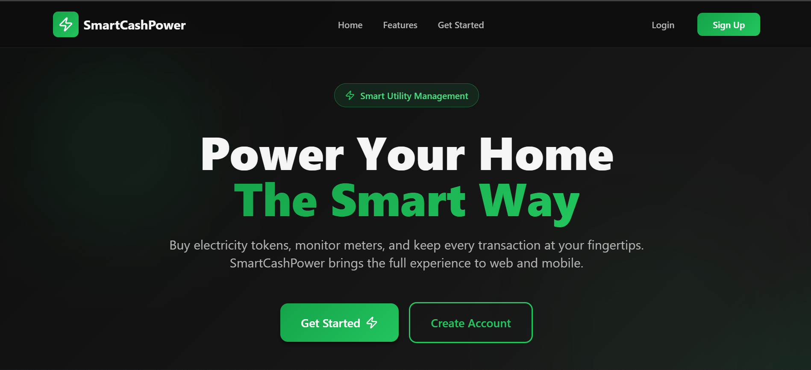

# 💡 SmartCashPower

> **A modern, full-stack electricity management platform revolutionizing prepaid utility services**

SmartCashPower is an enterprise-grade solution that enables users to purchase electricity tokens, manage multiple meters, and track consumption in real-time. Built with Spring Boot and React, it delivers a seamless experience for both customers and administrators.

[](https://openjdk.java.net/)
[](https://spring.io/projects/spring-boot)
[](https://reactjs.org/)
[](https://www.typescriptlang.org/)
[](https://www.postgresql.org/)

---

## 🖼️ Application Preview


*Modern, responsive landing page with dark theme and engaging UI*

---

## 🎯 Overview

SmartCashPower is a comprehensive prepaid electricity management system featuring:

- **🔐 Secure Authentication** - JWT-based authentication with role-based access control
- **⚡ Real-Time Monitoring** - Live meter consumption tracking and visualization
- **💳 Instant Purchases** - Seamless electricity token purchases with mobile money integration
- **📊 Admin Dashboard** - Comprehensive management tools for system administrators
- **🏠 Multi-Meter Support** - Manage multiple electricity meters from a single account
- **📱 Responsive Design** - Modern, mobile-first UI with dark theme

---

## ⚠️ Important Notes

### Mock API Integrations

**This project currently uses mock APIs for demonstration purposes:**

- **REG (Rwanda Energy Group) Integration**: Mock implementation simulating real meter data and token generation
- **Mobile Money Payments (MTN MoMo & Airtel Money)**: Mock payment processing for demonstration

**Future Plans**: I am actively seeking partnerships with REG and mobile money providers to integrate real APIs when this project is accepted for production use. These integrations are designed to be easily replaceable with actual API implementations.

---

## 🏗️ Architecture

### Technology Stack

#### **Backend**
- **Framework**: Spring Boot 3.2.0
- **Language**: Java 21
- **Database**: PostgreSQL
- **Security**: Spring Security with JWT
- **ORM**: Spring Data JPA (Hibernate)
- **Build Tool**: Maven

#### **Frontend**
- **Framework**: React 18+ with TypeScript
- **Build Tool**: Vite
- **Styling**: Tailwind CSS 4.1 with Custom Dark Theme
- **Routing**: React Router v6
- **HTTP Client**: Axios
- **State Management**: React Hooks
- **Notifications**: React Hot Toast

### System Architecture

```
┌─────────────────┐      ┌──────────────────┐      ┌─────────────────┐
│   React SPA     │─────▶│  Spring Boot API │─────▶│   PostgreSQL    │
│  (Port 5173)    │◀─────│   (Port 8080)    │◀─────│    Database     │
└─────────────────┘      └──────────────────┘      └─────────────────┘
        │                         │
        │                         │
        ▼                         ▼
┌─────────────────┐      ┌──────────────────┐
│  Tailwind CSS   │      │  Mock APIs       │
│  Dark Theme     │      │  (REG, MoMo)*    │
└─────────────────┘      └──────────────────┘
                         *To be replaced with real APIs
```

---

## ✨ Features

### 👤 User Features

| Feature | Description |
|---------|-------------|
| **Account Management** | Secure registration, login, and profile management |
| **Meter Management** | Add, view, and delete electricity meters |
| **Token Purchases** | Buy electricity with mobile money integration |
| **Transaction History** | Complete record of all purchases and consumption |
| **Real-Time Updates** | Live meter consumption visualization |
| **Password Recovery** | Admin-approved password reset workflow |

### 👨‍💼 Admin Features

| Feature | Description |
|---------|-------------|
| **User Management** | View, block, unblock, and delete user accounts |
| **Meter Oversight** | Monitor and manage all registered meters |
| **Transaction Reports** | Filter and export transaction data by date range |
| **Password Approvals** | Review and approve password reset requests |
| **System Analytics** | Real-time statistics and monitoring dashboard |
| **Search & Filter** | Advanced search across users, meters, and transactions |

---

## 🚀 Getting Started

### Prerequisites

- **Java 21** or higher
- **Node.js 16+** and npm/yarn
- **PostgreSQL** database
- **Maven** (included via wrapper)

### Backend Setup

1. **Clone the repository**
   ```bash
   git clone https://github.com/ManJoseph/Smart-Cash-Power.git
   cd "Smart Cash Power"
   ```

2. **Configure PostgreSQL**
   
   Create a database and user:
   ```sql
   CREATE DATABASE smartcashpower_db;
   CREATE USER smartcash_user WITH PASSWORD 'smartcashpower123@#';
   GRANT ALL PRIVILEGES ON DATABASE smartcashpower_db TO smartcash_user;
   ```

3. **Update application.properties** (if needed)
   ```properties
   spring.datasource.url=jdbc:postgresql://localhost:5432/smartcashpower_db
   spring.datasource.username=smartcash_user
   spring.datasource.password=smartcashpower123@#
   ```

4. **Run the backend**
   ```bash
   ./mvnw spring-boot:run
   ```
   
   Backend will start on `http://localhost:8080`

### Frontend Setup

1. **Navigate to frontend directory**
   ```bash
   cd smart-cash-power-ui
   ```

2. **Install dependencies**
   ```bash
   npm install
   ```

3. **Start development server**
   ```bash
   npm run dev
   ```
   
   Frontend will start on `http://localhost:5173`

4. **Build for production**
   ```bash
   npm run build
   ```

---

## 📡 API Documentation

### Authentication Endpoints

| Method | Endpoint | Description | Auth Required |
|--------|----------|-------------|---------------|
| POST | `/api/v1/auth/register` | Register new user | No |
| POST | `/api/v1/auth/login` | User login | No |
| PUT | `/api/v1/auth/profile` | Update profile | Yes |
| POST | `/api/v1/auth/change-password` | Change password | Yes |
| POST | `/api/v1/auth/forgot-password` | Request password reset | No |
| GET | `/api/v1/auth/reset-status` | Check reset approval | No |
| POST | `/api/v1/auth/reset-password` | Complete password reset | No |

### Meter Endpoints

| Method | Endpoint | Description | Auth Required |
|--------|----------|-------------|---------------|
| GET | `/api/v1/meters` | Get user's meters | Yes (USER) |
| POST | `/api/v1/meters` | Add new meter | Yes (USER) |
| DELETE | `/api/v1/meters/{id}` | Delete meter | Yes (USER) |
| PUT | `/api/v1/meters/{id}/units` | Update meter units | Yes (USER) |

### Transaction Endpoints

| Method | Endpoint | Description | Auth Required |
|--------|----------|-------------|---------------|
| POST | `/api/v1/transactions/purchase` | Initiate purchase | Yes (USER) |
| GET | `/api/v1/transactions/history` | Get transaction history | Yes (USER) |

### Admin Endpoints

| Method | Endpoint | Description | Auth Required |
|--------|----------|-------------|---------------|
| GET | `/api/v1/admin/users` | Get all users | Yes (ADMIN) |
| POST | `/api/v1/admin/users/{id}/block` | Block user | Yes (ADMIN) |
| POST | `/api/v1/admin/users/{id}/unblock` | Unblock user | Yes (ADMIN) |
| DELETE | `/api/v1/admin/users/{id}` | Delete user | Yes (ADMIN) |
| GET | `/api/v1/admin/meters` | Get all meters | Yes (ADMIN) |
| DELETE | `/api/v1/admin/meters/{id}` | Delete meter | Yes (ADMIN) |
| GET | `/api/v1/admin/reports/transactions` | Get transactions by date | Yes (ADMIN) |
| GET | `/api/v1/admin/password-resets` | Get pending resets | Yes (ADMIN) |
| POST | `/api/v1/admin/password-resets/{id}/approve` | Approve reset | Yes (ADMIN) |

---

## 🗄️ Database Schema

### Core Tables

**users**
- `user_id` (PK) - Unique identifier
- `email` - User email (unique)
- `password_hash` - BCrypt hashed password
- `phone_number` - Contact number (unique)
- `full_name` - User's full name
- `role` - USER or ADMIN
- `active` - Account status
- `created_at` - Registration timestamp
- `password_reset_requested_at` - Reset request time
- `password_reset_allowed_until` - Reset window expiry

**meters**
- `meter_id` (PK) - Unique identifier
- `meter_number` - Meter identifier (unique)
- `current_units` - Available electricity units
- `used_units` - Consumed units
- `active` - Meter status
- `user_id` (FK) - Owner reference

**transactions**
- `transaction_id` (PK) - Unique identifier
- `user_id` (FK) - User reference
- `meter_id` (FK) - Meter reference
- `amount` - Payment amount
- `units_purchased` - Units bought
- `transaction_date` - Purchase timestamp
- `status` - PENDING, SUCCESS, FAILED
- `transaction_reference` - External reference

---

## 🔐 Security Features

### Authentication & Authorization
- **JWT Tokens**: Stateless authentication with secure token generation
- **BCrypt Hashing**: Industry-standard password encryption
- **Role-Based Access**: USER and ADMIN role separation
- **Protected Routes**: Frontend and backend route protection

### Security Best Practices
- CORS configuration for allowed origins
- Input validation on all endpoints
- SQL injection prevention via JPA
- XSS protection in React components
- Secure password reset workflow
- Session management with JWT expiry

### Production Recommendations for future development
- Enable HTTPS/TLS encryption
- Implement rate limiting
- Add request logging and monitoring
- Use environment variables for secrets
- Enable database connection pooling
- Implement backup and recovery procedures

---

## 📁 Project Structure

```
Smart-Cash-Power/
├── Smart Cash Power/              # Backend (Spring Boot)
│   ├── src/main/java/smartcashpower/app/
│   │   ├── config/               # Security & CORS configuration
│   │   ├── controller/           # REST API controllers
│   │   ├── dto/                  # Data Transfer Objects
│   │   ├── exception/            # Custom exceptions
│   │   ├── integration/          # External API integrations (Mock)
│   │   ├── model/                # JPA entities
│   │   ├── repository/           # Data access layer
│   │   └── service/              # Business logic
│   ├── src/main/resources/
│   │   └── application.properties
│   └── pom.xml
│
└── smart-cash-power-ui/          # Frontend (React + TypeScript)
    ├── src/
    │   ├── components/           # React components
    │   ├── services/             # API service layer
    │   ├── App.tsx               # Main application
    │   └── main.tsx              # Entry point
    ├── vite.config.ts
    ├── tailwind.config.js
    └── package.json
```

---

## 🎨 UI/UX Highlights

- **Modern Dark Theme**: Professional black-green color scheme throughout
- **Responsive Layout**: Mobile-first design that works on all devices
- **Real-Time Updates**: Live meter consumption visualization
- **Interactive Modals**: Detailed views for meters and transactions
- **Search & Filter**: Advanced filtering across all data tables
- **Toast Notifications**: User-friendly feedback for all actions
- **Loading States**: Smooth loading indicators and animations
- **Error Handling**: Clear error messages and validation

---

## 🔄 Key Workflows

### Purchase Flow
```
User → Select Meter → Enter Amount → Choose Provider → Confirm
  → Backend Processes Payment (Mock) → Update Meter Units → Return Token
    → Display Confirmation → Toast Notification → Update Dashboard
```

### Password Reset Flow
```
User → Request Reset → Toast Notification (6s) → Admin Reviews → Admin Approves
  → User Receives Notification → User Resets Password
    → Confirmation → Redirect to Login
```

### Meter Draining (Real-Time Simulation)
```
Login → Fetch Meters → Start Draining Effect (0.002 kWh/sec)
  → Update UI Every Second → On Zero: Persist to Backend
    → On Logout: Save All States
```

---

## 🧪 Testing

### Backend Testing
```bash
./mvnw test
```

### Frontend Testing
```bash
npm run test
```

---

## 🤝 Contributing

**We welcome contributions and ideas from developers and customers!**

### How You Can Help

- **Developers**: Code contributions, bug fixes, feature implementations
- **Customers**: Feature requests, UI/UX feedback, usability suggestions
- **Everyone**: Documentation improvements, testing, bug reports

### Contribution Process

1. **Fork** the repository
2. **Create** a feature branch (`git checkout -b feature/AmazingFeature`)
3. **Commit** your changes (`git commit -m 'Add some AmazingFeature'`)
4. **Push** to the branch (`git push origin feature/AmazingFeature`)
5. **Open** a Pull Request

### Contribution Guidelines
- Follow existing code style and conventions
- Write clear commit messages
- Add tests for new features
- Update documentation as needed
- Ensure all tests pass before submitting

### Share Your Ideas

Have an idea for improvement? We'd love to hear it!
- Open an issue with the `enhancement` label
- Join discussions in existing issues
- Reach out via email with suggestions


---

## 📧 Contact & Support

**Developer**: Joseph Manizabayo  
**Email**: josephmanizabayo7@gmail.com  
**GitHub**: [@ManJoseph](https://github.com/ManJoseph)  
**LinkedIn**: [manjoseph](https://www.linkedin.com/in/manjoseph/)  
**Phone**: +250 784 461 703

For bug reports and feature requests, please open an issue on GitHub.

---

## 🗺️ Roadmap - Future Improvements

**These features are planned for future development:**

- [ ] **Real API Integrations**
  - [ ] REG (Rwanda Energy Group) official API integration
  - [ ] MTN Mobile Money production API
  - [ ] Airtel Money production API
  
- [ ] **Mobile Applications**
  - [ ] Native iOS application
  - [ ] Native Android application
  - [ ] Cross-platform support with React Native

- [ ] **Enhanced Features**
  - [ ] SMS notifications for low balance alerts
  - [ ] Email notifications for transactions
  - [ ] Multi-language support (Kinyarwanda, French, English)
  - [ ] Advanced analytics and reporting dashboards
  - [ ] Export reports to PDF/Excel
  
- [ ] **IoT Integration**
  - [ ] Automated meter reading via IoT devices
  - [ ] Real-time consumption monitoring
  - [ ] Smart meter compatibility
  
- [ ] **Payment Options**
  - [ ] Integration with more payment providers
  - [ ] Bank transfer support
  - [ ] Credit/Debit card payments
  
- [ ] **User Experience**
  - [ ] Voice commands and accessibility features
  - [ ] Chatbot support for customer service
  - [ ] In-app tutorials and help center

---

**Built with ❤️ for a smarter energy future**

*SmartCashPower - Empowering communities through intelligent utility management*

**Note**: This project is open to partnerships with energy providers and payment platforms. If you're interested in collaborating, please reach out!
